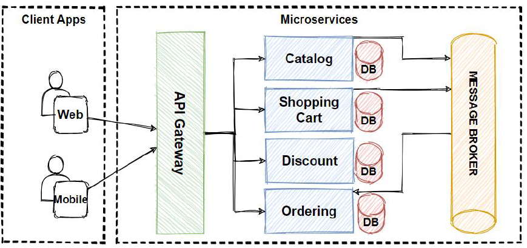
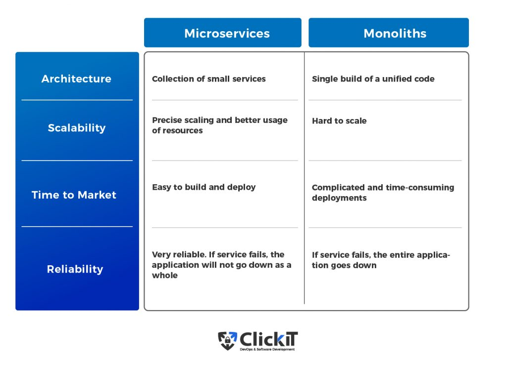

# Microservices

This README file contains some theory about what is a microservices architecture and docker, how it's being used in the industry and what's the best use case etc

### Diagram of Microservices

### What is microservices architecture

Microservice architecture, also known as ‘microservices,’ is a development method that breaks down software into modules with specialized functions and detailed interfaces.

In a monolithic application, all processes rely heavily on each other and operate as a single service.

Since all the code in a monolithic application is deployed together on the same base, adding or enhancing features becomes a complicated process, especially as the code base expands in size and complexity. Additionally, monolithic applications might be susceptible to failure. This is because tightly coupled, essentially interdependent processes are easily affected if a single process goes down.

Microservices allow large applications to be split into smaller pieces that operate independently. Each ‘piece’ has its responsibilities and can carry them out regardless of what the other components are doing. A microservices-based application summons the collective services of these pieces to fulfill user requests

### Why should we use it

There are many reasons like the ones shown below to use microservices:

1. They promote big data best practices. Microservices naturally fit within a data pipeline-oriented architecture, which aligns with the way big data should be collected, ingested, processed and delivered. Each step in a data pipeline handles one small task in the form of a microservice.
2. They are relatively easy to build and maintain. Their single-purpose design means they can be built and maintained by smaller teams. Each team can be cross-functional while also specialise in a subset of the microservices in a solution.
3. They enable higher-quality code. Modularising an overall solution into discrete components helps application development teams focus on one small part at a time. This simplifies the overall coding and testing process.
4. They simplify cross-team co-ordination. Unlike traditional service-oriented architectures (SOAs), which typically involve heavyweight inter-process communications protocols, microservices use event-streaming technologies to enable easier integration.
5. They enable real-time processing. At the core of a microservices architecture is a publish-subscribe framework, enabling data processing in real time to deliver immediate output and insights.
6. They facilitate rapid growth. Microservices enable code and data reuse the modular architecture, making it easier to deploy more data-driven use cases and solutions for added business value.
7. They enable more outputs. Data sets often are presented in different ways to different audiences; microservices simplify the way data can be extracted for various end users.
8. Easier to assess updates in the application life cycle. Advanced analytics environments, including those for machine learning, need ways to assess existing computational models against newly created models. A-B and multivariate testing in a microservices architecture enable users to validate their updated models.
9. They enable scale. Scalability is about more than the ability to handle more volume. It’s also about the effort involved. Microservices make it easier to identify scaling bottlenecks and then resolve those bottlenecks at a per-microservice level.
10. Many popular tools are available. A variety of technologies in the big data world, including the open-source community, work well in a microservices architecture. Apache Hadoop, Apache Spark, NoSQL databases and many streaming analytics tools can be used for microservices. We are also proud to partner with Pivotal in this area.

### When not to use it

Micrservices benefits can only be realised and maximised if you follow some cloud native principles. In the absence of these , it is best to not use microservices.

- CI/CD pipeline with devops automations
- Proper deployment and monitoring tools
- Managed cloud services to support your infrastructure
- Follow Key enabling technologies and tools like Containers, Docker, and Kubernetes.
- Broke dependencies with following async communications using Messaging and event streaming services.

If you don’t follow these principles in microservices architecture, you will again end-up with Distributed Monolith which is the worst case because you increase complexity of your architecture without getting any benefit of microservices

### Microservices vs Monolith vs 2tier architecture

# Docker

### What is Docker

Docker is a software platform that allows you to build, test, and deploy applications quickly. Docker packages software into standardized units called containers that have everything the software needs to run including libraries, system tools, code, and runtime. Using Docker, you can quickly deploy and scale applications into any environment and know your code will run.

### Use Cases

1. Deploying Software
2. Running lightweight linux distros
3. Hosting servers
4. Creating custom linux images
5. Creating developmemnt environments
